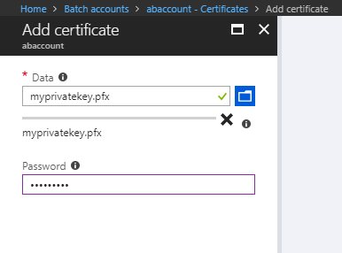

# Sample: Custom Activity using AKV enabled Linked Service 
### About this sample

C# Sample for resolving AKV enabled Azure Data Factory's Linked Services JSON payload and fetching the actual secrets using custom code. This sample Authenticates to AKV via a Certificate. Then deletes file/folder from the retrieved storage account.

### High level setup steps

1. Create **Self-signed certificate**, and generate private and public keys

2. Install the **Private Key** in **Azure Batch Account** and **Pools** respectively

3. Create an **Azure Active Directory application** and add the **public key for Authentication**. (Currently Azure Batch does not support [MSI](https://docs.microsoft.com/azure/active-directory/managed-service-identity/overview), hence we are creating a Service Principal with a public key to authenticate to the Azure Key Vault)

4. **Grant** the **AAD Application**(created in step 3) **access** to **Azure Key Vault**

5. **Configure the Custom Activity** correctly and **Run** (Debug in ADF UI).  

   Ensure your code correctly parses the linkedServices.json based on the Reference Objects you are passing and the activity.json for accessing Extended Properties. In the sample, we are passing an AKV Linked Service and an Azure Storage Linked Services with AKV Secret (AKV enabled Azure Storage Linked Service), and passing Storage Container name and Folder path to be deleted through the Extended Properties (in activity.json). 

### How to run this sample

#### Generate Self-signed Certificate

1. Create a certificate on your machine under **current user** store. In this tutorial we will use PowerShell (Run as administrator) on a Windows machine to generate the certificate: 

   ```powershell
   PS C:\WINDOWS\system32> New-SelfSignedCertificate -Subject "CN=akv.samplecustomactivity.com"
   -CertStoreLocation "cert:\CurrentUser\My" -KeyLength 2048 -KeySpec Signature
   ```

   

   > [!Note]
   >
   > Copy the **Thumbprint** and store it for later usage. We will replace this value in the *App.config* file in the code in the later steps.

2. Go to 'Manage User Certificates' (certmgr.msc) in Control Panel, and locate the certificate under Personal -> Certificates. 

   

3. Export the private key -  use default options in Export File Format window, set a **password**, **filename**.

   

   

   

   

   

   

4. Export the public key - use default option, specify **filename**.

   


5. You can find the exported files in **C:\Windows\System32**


#### Create Azure Active Directory Application

1. Create an [**Azure Active Directory application**](https://docs.microsoft.com/azure/azure-resource-manager/resource-group-create-service-principal-portal#create-an-azure-active-directory-application). Get the [Application ID](https://docs.microsoft.com/en-us/azure/azure-resource-manager/resource-group-create-service-principal-portal#get-application-id-and-authentication-key) and add this value in the ***App.config*** in the **code**.

   

2. Upload the **Public key** for **Authentication**, rather than generating a new key for authentication.

   

   

#### Grant rights to the Azure Active Directory Application to access KeyVault

1. Navigate to the appropriate **Azure Key Vault** in **Azure Portal**. Click on **Access Policies** and **Add new** 


2. **Select** **Principal**, and search for the **Azure Active Directory Application name** created earlier, and click **Select** then **OK**.


3. Click **Save**.

   

#### For running it on Azure Batch

1. When you run the Custom Activity in Azure Data Factory, the *linkedServices.json* file will be made available to your custom activity code. You would need to configure the *Reference Objects* in Custom Activity to make sure the correct Linked Services are passed into the Custom Activity. 

   

   

2. In **Batch Account**, assign the *self-signed certificate ('myprivatekey' created in Step 3 under Generate Certificate section)*. We need to assign the certificate to the batch account, this will in turn allow us to assign it to the pool (VMs). 

  The easiest way to do this, is a one off task through the portal, **go to your batch account**, then the **“certificates” blade** and click **add**. Upload the **PFX file** we generated earlier and supply the **password**. 

  

  

  

  Once complete, this should show in the list of certificates and you can verify the thumbprint.
  You can now **create a batch pool** or **select an existing pool**, and you should be able to find the above certificate under the **certificate blade** and then be able to assign the certificate to the pool. When you do so, make sure you select **Store Name** -> *"My"*, **Store Location** -> *“CurrentUser”* for the store location. 

  > [!Note] 
  >
  > This cert will now be available for all the tasks running on the batch pool nodes.

  

  

3. **Configure** the **Custom Activity** in Azure Data Factory.  

   1. Ensure the parsing logic in the code would be able to work with your Linked Services. The code should work without requiring any changes while passing an [AKV Linked Service](https://docs.microsoft.com/azure/data-factory/store-credentials-in-key-vault#azure-key-vault-linked-service) and an [AKV enabled Azure Storage Linked Service](https://docs.microsoft.com/azure/data-factory/store-credentials-in-key-vault#reference-secret-stored-in-key-vault) 

   2. The *container* and *folder* in the Storage Account that is to be deleted by the Custom Activity needs to be mentioned under Extended Properties in Custom Activity for this Sample. *Make sure the folder and container exists in the respective storage account.* 

      Code parses the *extendedProperties* in the JSON to retrieve the Container name and Folder path to be deleted.

      

   3. Run the Custom Activity, Click **Debug** in [ADF UI](https://adf.azure.com/).

### For running it on a local windows machine (debugging)
1. In code, modify the *linkedServices.json* accordingly with your **AKV URL**/ **Secret name**. 

   Since ADF will not be passing the *linkedServices.json* while running locally, we will have to make this file available in the same directory as the executable to emulate the environment.

   > [!Note]
   >
   > This method is also very useful while debugging your custom code locally before deploying it to Azure Batch/ Custom Activity.

2. Make sure the Certificate exists in the *CurrentUser* Certificate Store.  

3. Run the code (**F5**).
